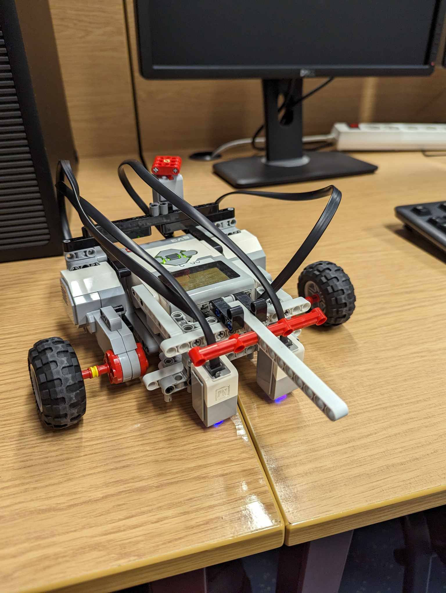

# WRI - laboratorium

Grupa laboratoryjna 105, realizacja stacjonarna 24L

Członkowie zespołu:

- Tomasz Owienko
- Bartosz Kisły
- Jakub Woźniak

## Cel laboratorium

Celem laboratorium było zbudowanie robota z zestawu LEGO MINDSTORMS EV3 oraz oprogramowanie go pod kątem realizacji zadań przemieszczania się wzdłuż linii (*follow the line*) oraz transportu ładunku między zadanymi punktami.

## Opis konstrukcji

Zbudowany robot charakteryzuje się niskim środkiem ciężkości oraz bardzo szerokim rozstawem kół. Baza jezdna składa się z dwóch gumowych kół napędowych o szerokim bieżniku wysuniętych przed środek ciężkości oraz dwóch kół opartych na metalowych kulkach mających za zadanie stabilizować robota z tyłu. Niewiele przed osią obrotu umieszczono dwa sensory koloru na wysokości ok. 5mm od podłoża i w odległości ok 2cm pomiędzy sobą. Z tyłu robota umieszczono przycisk pozwalający zresetować zawarty w oprogramowaniu automat stanowy - finalnie okazał się on zbędny. Nad sensorami koloru umieszczono podłużny klocek LEGO (*"widły"*), który w zadaniu transportera służył do przesuwania ładunku po planszy bez podnoszenia go. Podczas realizacji zadania FTL zwiększono nieco rozstaw czujników koloru, co niestety nie zostało uchwycone na zdjęciach.

Nazwa robota: *Widłogon*

### FTL

<p float="left">
  
  
</p>

### Transporter

<p float="left">
  
  
</p>


## Oprogramowanie

Algorytm sterowania robotem zaimplementowano w języku Python z wykorzystaniem biblioteki `python-ev3dev`.

TODO opisać algorytm (FTL i transporter)


## Procedura kalibracji

Z uwagi na rozbieżności w odczytach z obu sensorów konieczna była kalibracja jednego z nich. Algorytm ustalania odczytanego koloru opierał się na odczycie z sensora w przestrzeni HSV. Kolory zielony i czerwony rozpoznawane były w oparciu o odległość składowej H od zadanej wartości (odpowiednio 0.4 i 0) a także składowe S oraz V przekraczające zadany próg (0.55 i 35). Kolor czarny determinowany był przez brak spełnienia warunków do uznania odczytanego koloru za czerwony bądź zielony oraz wartość składowej V nie większą niż 150. Jeśli żaden z wcześniej wymienionych warunków nie był spełniony, przyjmowano kolor biały:

```
IF |H - 0.4| < 2 AND S > 0.55 AND V > 35:
    GREEN
ELSE IF |min(H, 1-H)| < 0.2 AND S > 0.55 AND V > 35:
    RED
ELSE IF V <= 150:
    BLACK
ELSE:
    WHITE
```

Dodatkowo, z uwagi na niską stabilność odczytów koloru zielonego (na planszy występowały czasami pobrudzone płytki, które błędnie rozpoznawane były jako zielona linia) przyjęto, że robot będzie wykrywał kolor zielony dopiero po odczytaniu go 3 razy ciągiem.

## Procedura doboru parametrów

Algorytm sterowania przyjmował cztery parametry:

- `BASE_SPEED` - bazowa prędkość robota
- `SLOW_SPEED` - szybkość obrotu koła po stronie przeciwnej do kierunku skrętu podczas skręcania
- `BACKWARDS_FACTOR` - współczynnik skalowania wartości `SLOW_SPEED` przy stosowaniu jej do koła po stronie zgodnej z kierunkiem skręcania (co do modułu)
- `P` - parametr wygładzania zmian prędkości

Celem strojenia parametrów było uzyskanie jak największej wartości `BASE_SPEED` przy poprawnym zachowaniu robota. Parametry `SLOW_SPEED` i `BACKWARDS_FACTOR` wpływały na sposób pokonywania zakrętów przez robota - większe wartości pozwalały skręcać bardziej agresywnie i szybciej dostosowywać się do nagłych zmian kierunku jazdy, ale zmniejszały stabilność przejazdu przez skrzyżowania (co udało się rozwiązać przez wprowadzenie stanów ruchu). Parametry dostrojono w sposób pseudo-losowy po utworzeniu pierwszej wersji algorytmu sterowania, a następnie dostrajano na jego finalnej wersji. 

W zadaniu FTL włączenie mechanizmu stanów ruchu pozwoliło uzyskać bardzo stabilne przejazdy przez skrzyżowania, w związku z czym skupiono się na maksymalizacji szybkości przejazdu. Zrównano wartości `BASE_SPEED` oraz `SLOW_SPEED` oraz ustawiono `BACKWARDS_FACTOR` na 1.5, co pozwoliło w szybki sposób pokonywać zakręty pod kątem prostym (konieczne było tu zwiększenie rozstawu sensorów w konstrukcji). Wygładzanie zmian prędkości zostało wyłączone (`P=1`), gdyż jego głównym zastosowaniem była stabilizacja przejazdu przez skrzyżowania. Następnie zwiększano wartość `BASE_SPEED` aż do utraty stabilności - na zaliczeniu wykorzystano wartość 26, faktyczna utrata stabilności następowała około wartości 28 - robot nie był w stanie zbierać odczytów z sensorów wystarczająco szybko i przejeżdżał prosto przez niektóre zakręty. W

W zadaniu transportera konieczne było uzyskanie płynnego ruchu robota z uwagi na sposób transportu ładunku - ponieważ był on przesuwany po planszy, zbyt agresywny ruch mógłby spowodować zgubienie ładunku. Nie korzystano z agresywnych skrętów (`BACKWARDS_FACTOR=0.8`, `SLOW_SPEED=0.5*BASE_SPEED`), ustawiono duży rozmiar okna wygładzania (`P=0.65`). Najwyższą przetestowaną wartością `BASE_SPEED` było 20 - na sprawdzenie wyższych zabrakło czasu.

## Algorytm Śledzenia Linii (Follow the Line - FTL)

Algorytm "Follow the Line" jest odpowiedzialny za prowadzenie robota wzdłuż linii na podłożu przy użyciu dwóch sensorów koloru. Robot dostosowuje swoje ruchy na podstawie koloru wykrytego przez te sensory.

* Inicjalizacja:

    Robot jest inicjalizowany z określonymi parametrami prędkości (`BASE_SPEED`, `SLOW_SPEED`, `BACKWARDS_FACTOR`) oraz współczynnikiem proporcjonalnym P do kontroli proporcjonalnej.

* Zbieranie Danych z Sensorów:

    Dwa sensory koloru (`sensor_left` i `sensor_right`) są używane do wykrywania koloru linii. Kolor jest określany za pomocą funkcji `get_current_color`, która pobiera odczyt z sensora i kalibruje go, aby określić, czy jest to kolor czarny, biały, czerwony czy zielony.

* Główna Pętla:

    Robot stale sprawdza kolor wykrywany przez lewy i prawy sensor.
    Jeśli lewy sensor wykrywa linię (główny kolor), a prawy nie, robot skręca w lewo.
    Jeśli prawy sensor wykrywa linię, a lewy nie, robot skręca w prawo.
    Jeśli żaden sensor nie wykrywa linii, robot jedzie prosto.
    Jeśli oba sensory wykrywają linię, robot kontynuuje jazdę na wprost.

* Zarządzanie Stanami:

  Algorytm utrzymuje stany (`DEFAULT`, `LEFT_TURN`, `RIGHT_TURN`) w celu zapewnienia płynnych przejść między różnymi ruchami.
  Funkcje `set_speed_left` i `set_speed_right` są używane do dostosowywania prędkości silników w zależności od bieżącego stanu.

## Algorytm Transportera

Algorytm "Transporter" jest zaprojektowany do prowadzenia robota w celu transportu ładunku między wyznaczonymi punktami. Wykorzystuje on wykrywanie określonych kolorów (czerwony i zielony), aby inicjować sekwencje podnoszenia i zrzucania ładunku.

* Inicjalizacja:
  Podobnie jak w algorytmie FTL, algorytm transportera inicjalizuje robota z określonymi parametrami prędkości i kontroli.

* Zbieranie Danych z Sensorów:
  Te same sensory koloru są używane do wykrywania kolorów czerwonego i zielonego, które sygnalizują punkty startowe i końcowe sekwencji transportu ładunku.

* Główna Pętla:
  Robot stale sprawdza kolory wykrywane przez sensory.
  Gdy wykryty zostanie kolor zielony, wywoływana jest funkcja `red_sequence`, która przemieszcza robota do strefy ładunkowej.
  Gdy wykryty zostanie kolor czerwony, wywoływana jest funkcja `green_sequence`, która przemieszcza robota w celu zrzucenia ładunku.

* Sekwencje:
  Funkcja `red_sequence` przesuwa robota do przodu aby nadziać ładunek, wykonuje obrót o 180 stopni, a następnie kontynuuje jazdę..
  Funkcja `green_sequence` przesuwa robota do przodu, a następnie cofa go na krótki czas, aby zsunąć ładunek z wideł.
  

## Problemy

Wśród problemów napotkanych podczas realizacji zadania warto wymienić następujące:

- Niepewność co do konstrukcji robota - finalna baza jezdna powstała około trzecich zajęć laboratoryjnych, kluczowe było zauważenie, że do uzyskania dobrych wyników kluczowy jest szeroki rozstaw kół i mała odległość pomiędzy sensorami a osią obrotu
- Wady sprzętu - w odczytach z sensorów koloru często pojawiały się losowe kolory, które trzeba było odfiltrowywać. Wymiana sensora na inny jedynie pogłębiła problem - np. robot rozpoznawał kolor zielony jako niebieski. Innym aspektem, o którym warto wspomnieć, jest zależność między zachowaniem robota a poziomem naładowania baterii - często wymiana akumulatorów na nowe drastycznie zwiększała szybkość i zwrotność robota
- Problemy z komunikacją sieciową - wielokrotnie podczas testowania robota komputer laboratoryjny tracił połączenie z robotem i konieczne było restartowanie interfejsów sieciowych
- Język Python - szybkość działania programu ograniczona była przez zastosowaną technologię, na jazdę robota wpływ miały nawet takie drobiazgi, jak wywołania funkcji `print`
- Różnice w płytkach na planszy - niektóre płytki różniły się wysokością o ok. 1mm, co w zadaniu transportera mogło zablokować ruch robota, ponieważ transportowany obiekt przesuwany był po planszy (to właśnie wydarzyło się podczas jednego z zaliczeń)

## Osięgnięte wyniki

Robot osiągnął najlepszy czas w grupie laboratoryjnej zarówno w zadaniu FTL (1:21:02) jak i transportera (0:50:44)

<p></p>

### Link do repozytorium z kodem na Githubie

https://github.com/SNURTEL/24l-wri
